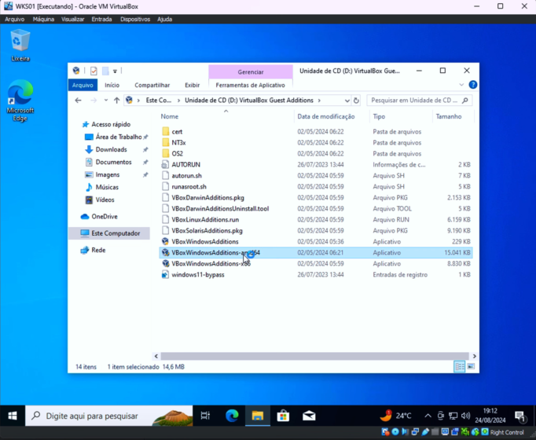

# Projeto SIEM - Documentação
Esse documento serve para explicar o projeto e descrever passo a passo como realizá-lo no seu ambiente.

## Instalação e configuração do homelab
Nessa seção, você irá instalar todos os ambientes necessários para a realização deste projeto.

### VirtualBox
O VirtualBox é um software de virtualização gratuito e de código aberto que permite criar e gerenciar máquinas virtuais(VMs) em um único computador.
Com ele, você pode instalar sistemas operacionais completos(como Windows, Linux ou macOS) em uma "máquina virtual" que roda dentro do sistema operacional principal, conhecido como sistema hospedeiro.

Algumas das principais funcionalidades do VirtualBox:
- **Variedade de sistemas operacionais**: Suporta a criação de VMs para diversos sistemas operacionais.
- **Compartilhamento de pastas e dispositivos**: Permite acessar pastas do sistema hospedeiro e compartilhar dispositivos USB nas máquinas virtuais.
- **Modo de rede variável**: Oferece diversas opções para configurar a rede, como NAT, bridge e host-only, permitindo controlar como a VM se conecta à rede externa e interage com o hospedeiro.
- **Snapshots**: Permite criar "fotos" do estado atual da máquina virtual para facilitar a recuperação em caso de erros.

A melhor maneira de instalar o VirtualBox é através do site oficial [aqui](https://www.virtualbox.org/wiki/Downloads)

Aqui você deve escolher o download que pertence ao seu SO principal.


Feita a instalação, execute o arquivo de setup do VirtualBox.

### Kali Linux
O Kali Linux é uma distribuição Linux voltada para segurança da informação, conhecida por sua ampla coleção de ferramentas para testes de penetração, análise forense digital, e pesquisa em segurança cibernética.
Ele é baseado no Debian e foi desenvolvido pela Offensive Security, uma organização conhecida na área de segurança.

Características Principais do Kali Linux:
- Conjunto de ferramentas: O Kali Linux vem com mais de 600 ferramentas pré-instaladas voltadas para atividades como:
    - Testes de penetração (ex: Nmap, Metasploit).
    - Engenharia reversa.
    - Análise forense.
    - Segurança de rede.
- Facilidade de uso para profissionais de segurança: Ele é projetado para ser uma plataforma fácil de configurar e usar para profissionais de segurança e entusiastas, fornecendo um ambiente otimizado para essas atividades.
- Atualizações constantes: A equipe da Offensive Security mantém o Kali Linux sempre atualizado com as ferramentas e as correções de segurança mais recentes.

O Kali Linux é de suma importância para o projeto porque permite a realização de testes de penetração e segurança de rede para estimular a geração de logs que será abordada mais a frente.

Para a instalação, acesse o site oficial do Kali Linux [aqui](https://www.kali.org/get-kali/#kali-platforms).

Escolha o download do Kali para o **VirtualBox** conforme a arquitetura.


Após o download, haverá um arquivo compactado que precisará ser extraído. Escolha qualquer local para extrair.

Se não puder extrair, instale o WinRar [aqui](https://www.win-rar.com/start.html?&L=9).

Após isso, uma pasta com dois arquivos é extraída. Clique duas vezes no arquivo que se parece com uma caixa azul para abrir o arquivo no VirtualBox(certifique-se de já ter instalado o VirtualBox).

A tela será algo parecido com isso, clique em iniciar e aguarde a inicialização.


Após aparecer a tela de início, faça o login com o usuário **kali** e senha **kali**.

### Ubuntu

O Ubuntu é uma distribuição Linux popular, conhecida por ser amigável ao usuário e amplamente utilizada para desktops, servidores e até dispositivos IoT. Ele é baseado no Debian e é mantido pela empresa britânica Canonical, que oferece suporte e atualizações de segurança regulares para a plataforma.

Características do Ubuntu

- Fácil de Usar:
    - O Ubuntu foi projetado para ser intuitivo e acessível para iniciantes em Linux, com uma interface gráfica amigável (chamada GNOME no Ubuntu padrão).
    - É bem documentado, e a comunidade de usuários é muito ativa, facilitando a resolução de dúvidas e problemas.

- Lançamentos Regulares:
    - LTS (Long Term Support): As versões LTS, lançadas a cada dois anos, recebem suporte e atualizações por cinco anos, tornando-as ideais para uso em servidores e ambientes de produção.
    - Intermediárias: Versões intermediárias são lançadas a cada seis meses, com suporte de nove meses, e geralmente trazem novos recursos e melhorias.

- Segurança e Suporte de Longo Prazo:
    - A Canonical fornece suporte e atualizações de segurança para o Ubuntu, e as versões LTS são uma escolha comum para servidores pela estabilidade e durabilidade.

Para a instalação, acesse o site oficial do Ubuntu [aqui](https://ubuntu.com/download/desktop).

Escolha a versão LTS para ter o SO mais atual.

Ao obter a ISO do Ubuntu, abra o VirtualBox e clique em **Novo**.

Dê um nome à VM.

No campo que pede a imagem a ser utilizada, escolha o caminho para a ISO do Ubuntu e marque a opção **Pular Instalação Desassistida**.

Abra a aba do Hardware e coloque estas configurações, para ter 2 CPUs e 4 GB de RAM. Após isso clique em finalizar.


Após isso, inicialize a VM do Ubuntu.

Haverá uma pequena inicialização em que será necessário criar uma conta com nome e senha. Crie do jeito que achar melhor.

É importante notar que na inicialização, é preciso escolher instalar o Ubuntu e, na criação da conta, fazer a instalação manual.

### Metasploitable

O Metasploitable é uma máquina virtual vulnerável projetada para fins educacionais e de teste. Ele é usado principalmente por profissionais de segurança, estudantes e entusiastas para aprender e praticar testes de penetração e outras atividades relacionadas à segurança cibernética.

Características do Metasploitable

- Ambiente Seguro para Testes:
    - Ele é intencionalmente configurado com várias vulnerabilidades conhecidas em sistemas, serviços e softwares, oferecendo um ambiente seguro e controlado para prática.

- Variedade de Vulnerabilidades:
    - Inclui vulnerabilidades em serviços como FTP, SSH, HTTP, bancos de dados, e até sistemas operacionais.
    - Exemplos incluem credenciais padrão, injeção de SQL, vulnerabilidades no PHP, backdoors, entre outros.

- Compatível com Ferramentas de Segurança:
    - Foi projetado para ser explorado usando ferramentas como o Metasploit Framework, Nmap, Nikto, e outros.

**Importante**: O Metasploitable deve nunca ser conectado a uma rede pública ou exposto à internet. Ele foi projetado para ser usado exclusivamente em ambientes fechados, como laboratórios locais ou redes virtuais (homelabs). Sempre execute-o em um ambiente isolado, como em sua máquina virtual no VirtualBox, para evitar que suas vulnerabilidades sejam exploradas acidentalmente.

Para a instalação, acesse o site SourceForge [aqui](https://sourceforge.net/projects/metasploitable/files/Metasploitable2/) e clique em **metasploitable-linux-2.0.0.zip**. Após isso, aguarde aparecer o botão de download e clique nele.

Depois de feito o download, extraia o arquivo zip para gerar a pasta do metasploitable.

Abra o VirtualBox e clique em **Novo**. Siga a imagem abaixo, com foco em **escolher o caminho com a pasta certa que foi extraida**, colocando um nome, escolhendo o tipo **Linux**, e o Subtipo **Outro Linux**. Não há necessidade de alterar o Hardware. **Não finalize ainda**. O metasploitable não utiliza imagem porque o arquivo já vem com a máquina virtual já configurada(indicado pelo arquivo **.vmdk**) que será colocada na aba Disco Rígido.


Abra a aba Disco Rígido e clique na opção **Utilizar um disco rígido virtual existente**. Clique no ícone de pasta ao lado e depois em **Acrescentar**. Vá até a pasta do metasploitable e selecione o arquivo .vmdk que é simbolizado por um ícone de caixa azul. Após acrescentar, clique no disco e depois embaixo da janela em **Escolher**. Clique em finalizar.


Inicie o Metasploitable.

Ao iniciá-lo, ele pedirá o login e senha. Os dois são o mesmo: **msfadmin**.

Tome cuidado ao clicar com o mouse. O metasploitable não foi feito para ter uma interface gráfica, então, ao receber a informação de clique do mouse, o mouse irá sumir e não poderá ser usado. Para voltar o controle do mouse, aperte a tecla configurada como host(Host-Key) normalmente CTRL-direito ou ALT-direito. Caso contrário, terá de reiniciar sua máquina.

### Configuração da Rede

**Certifique-se de que o Kali, Ubuntu e Metasploitable estejam desligados.**

Para que o Metasploitable e o Kali-Linux se comuniquem, é necessário que ambos estejam em uma mesma rede. Para isso, iremos criar uma rede própria e configurar ambas as VMs para ela.

No VirtualBox, clique nas três linhas horizontais em **Ferramentas** e selecione **Rede**.


Depois, vá até a aba **Redes NAT** e clique em **criar**.


NAT (Network Address Translation) é uma técnica usada em redes de computadores para modificar os endereços IP de pacotes enquanto eles passam por um roteador ou dispositivo semelhante.

O NAT permite que vários dispositivos em uma rede privada compartilhem um único endereço IP público para acessar a Internet. O roteador realiza a tradução entre os endereços IP privados e o endereço IP público atribuído a ele.
Exemplo:
- Rede Interna (Privada):
    - Dispositivos têm endereços como 192.168.0.x.
- Rede Externa (Pública):
    - O roteador possui um único IP público, como 203.0.113.1.

Quando um dispositivo na rede interna acessa a Internet, o roteador:
- Substitui o endereço IP privado pelo IP público no pacote.
- Mantém uma tabela para saber qual dispositivo interno corresponde a cada conexão.

Ao receber uma resposta, o roteador traduz o IP de volta para o endereço interno apropriado.

No nome coloque **Externa** para sinalizar que essa é nossa rede externa e troque o IP no campo abaixo para **192.168.50.0/24**. Certifique-se de que este IP não seja o mesmo da sua máquina real para que não haja conflito.

Quando um IP de rede possui /24 no final ou possui máscara de rede 255.255.255.0, dizemos que a rede pode ter até 254 hosts. Isso decorre do fato do IP reservar 32 bits para o endereço e, quando indicamos o /24, é o mesmo que sinalizar que 24 bits são para a rede e 8 bits para o host. Assim, achamos o número 8, que ao elevarmos 2 por 8 chegamos em 256 hosts.
Por fim, o padrão é reservar o host 0 para identificar a rede e o host 255 para se comunicar com os dispositivos da rede(nesse caso, 192.168.50.0 e 192.168.50.255 respectivamente). Assim chegamos em 254 hosts possíveis.


Certifique-se de que o **DHCP** está habilitado.

O DHCP (Dynamic Host Configuration Protocol) é um protocolo de rede que automatiza a configuração de dispositivos em uma rede, permitindo que eles obtenham informações essenciais, como:

- Endereço IP: O endereço único que identifica o dispositivo na rede.
- Máscara de Sub-rede: Define quais partes do endereço IP pertencem à rede e quais identificam o host.
- Gateway Padrão: O endereço do roteador que permite a comunicação com outras redes.
- Servidores DNS: Para traduzir nomes de domínio (como example.com) em endereços IP.

O processo básico do DHCP ocorre em quatro etapas principais, conhecidas como DORA:
- Discover (Descoberta): O dispositivo cliente envia um broadcast solicitando um endereço IP na rede.
- Offer (Oferta): O servidor DHCP responde com uma oferta de configuração de rede.
- Request (Solicitação): O cliente aceita a oferta enviando uma solicitação para confirmar o uso das configurações.
- Acknowledge (Reconhecimento): O servidor confirma e fornece os dados ao cliente.

A maior vantagem do protocolo DHCP é a automatização de configuração de IPs, senão, seria necessário configurar cada um dos 254 IPs, ou seja, atribuir manualmente um endereço IP para cada dispositivo na rede.

Clique em **Aplicar** no canto inferior direito.

Agora é só configurar o Kali e o Metasploitable na rede recém-criada(Ubuntu será configurado depois).

Clique no Kali, depois em **Configurações**(engrenagem no topo) e em seguida na aba **Rede**. No campo "**Conectado a**" escolha **Rede NAT** e no campo nome **Externa**. Finalize com **Ok**. Faça o mesmo para o Metasploitable.


Vamos verificar se há conexão entre elas. Abra as duas VMs, Kali e Metasploitable, e deixe em tela dividida para uma melhor visualização como na imagem abaixo.


No Kali, inicie um terminal clicando no ícone de terminal preto no canto superior esquerdo e coloque o comando a seguir para ver o IP do Kali:

```bash
$ ip a
```
O IP aparecerá no campo **eth0** em **inet** como 192.168.50.x

Já no Metasploitable, coloque o comando abaixo:

```bash
$ ifconfig
```

Igual no Kali em **eth0**, mas em **inet addr** como 192.168.50.x 

Agora teste a conexão utilizando o comando **ping** em ambas as máquinas e veja se ocorre uma sequência de linhas demonstrando conexão.

O comando ping utiliza o protocolo ICMP (Internet Control Message Protocol) para testar a conectividade de rede entre dispositivos.

O ping envia pacotes ICMP Echo Request para o host de destino e aguarda a resposta com pacotes ICMP Echo Reply. O processo é basicamente:
- O comando ping envia um pacote ICMP Echo Request (não um pacote SYN, como no TCP).
- O host de destino, se estiver acessível e não bloquear ICMP, responde com um pacote ICMP Echo Reply.
- O tempo entre o envio e o recebimento da resposta é medido, fornecendo informações sobre o tempo de latência.

```bash
$ ping <IP Alvo>
```

### Windows

O Windows é um sistema operacional desenvolvido pela Microsoft. É muito popular por possuir uma interface gráfica amigável, por ser versátil com diversos dispositivos como desktops, laptops, tablets e servidores e ser compatível com diversos softwares e hardwares.

Para ter uma máquina Windows no VirtualBox, é preciso ter uma imagem de disco ou ISO(International Organization for Standardization).
ISO ou imagem de disco é um arquivo(.iso) que contém uma cópia exata dos dados de um disco, como um CD, DVD ou Blu-ray. É frequentemente usado para distribuir sistemas operacionais, programas ou jogos em formato digital.

Para baixar a iso do windows 10 que irá ser utilizado no projeto, é preciso montar a imagem de disco com um programa que está no site oficial da microsoft e pode ser acessado [aqui](https://www.microsoft.com/pt-br/software-download/windows10)
**Note que para o funcionamento do projeto, não é necessária mais que uma VM do Windows. Irei utilizar mais que uma para obter mais logs que o normal, simulando uma rede de computadores mais ampla(um servidor ubuntu, metasploitable e dois windows).**


Com isso, abra o software de instalação do windows e escolha a opção **criar mídia de instalação**


Depois, clique em avançar para manter o windows com as configurações padrão e selecione a opção **arquivo ISO**


Salve em alguma pasta o arquivo e abra o VirtualBox.

Clique em **Novo**, dê um nome para a VM(no meu caso, WKS01), selecione a pasta para manter a VM, selecione o arquivo iso que acabou de ser instalado e, por fim, confirme a opção **Pular Instalação Desassistida**
Na área de hardware, coloque 4GB de RAM(4096MB) e duas CPUs. Deixe a aba **Disco Rígido** como está.

Abra a VM do Windows, vai abrir a tela de configuração do instalador do Wnindows. Deixe como está e clique em **Avançar**.


Não há chave do Windows, então clique na opção **Não tenho a chave do produto**.


Clique na opção **Personalizada** para o tipo de instalação e depois em **Avançar** já que há apenas uma partição para utilizar.


Deixe a instalação ocorrer até chegar na tela de escolher a região.
Escolha a região e o layout de teclado(pule o segundo layout de teclado).
Clique na opção **Configurar para uma organização** e depois em **Ingresso no domínio**.


Crie um nome de usuário e uma senha que se lembre facilmente. Nas perguntas de segurança, coloque uma mesma palavra para as três perguntas.

A partir daqui, irá ter diversas recomendações de configurações do windows. Ignore todas ou selecione **Não**

Entre com a senha criada e troque o nome do computador para o nome da VM.

Quando se tenta maximizar a janela da VM, a máquina não acompanha a borda. Por isso, é necessário inserir a imagem de cd como indicado na imagem abaixo.


Próximo ao diretório C, irá aparecer o ícone do VirtualBox. Clique nele e abra o arquivo indicado abaixo. Clique avançar sem mudar nada e depois instale. Ao final, clique em finalizar.



**Como mencionado anteriormente, é de sua escolha ter apenas uma VM do Windows, duas ou mais. Se seguir o meu modelo de projeto, faça outra máquina Windows do mesmo jeito apenas alterando o nome(no meu caso, WKS02).**

Por fim, iremos conectar a VM na rede que foi criada.

Faça o mesmo processo que foi feito no Ubuntu, Kali e Metasploitable, clique na VM, **Configurações**, **Rede**, **Conectado a: Rede NAT** e **Nome: Externa**

**Assim, foi finalizado a instalação de todas as VMs do nosso homelab.**

## Elasticsearch

O Elasticsearch é uma ferramenta essencial em uma arquitetura de SIEM, pois é usada como um motor de busca e análise de dados. Ele desempenha um papel crítico ao permitir que grandes volumes de dados de logs, eventos e métricas sejam armazenados, pesquisados e analisados de forma eficiente.

Papel do Elasticsearch no SIEM

- Armazenamento Centralizado:
    - Todos os logs e eventos coletados de diferentes fontes, como firewalls, sistemas operacionais, aplicativos e dispositivos de rede, são enviados para o Elasticsearch. Ele é projetado para lidar com grandes volumes de dados em tempo real.
- Indexação e Busca Rápida:
    - O Elasticsearch indexa os dados para que possam ser consultados rapidamente. Em um SIEM, isso permite buscas rápidas por incidentes de segurança, padrões de comportamento suspeitos ou eventos específicos.
- Análise e Correlação de Dados:
    - Ele trabalha com ferramentas como o Logstash (coleta e processamento de dados) e o Kibana (visualização de dados) para identificar padrões e tendências nos eventos de segurança.

Para instalação, irei seguir o guia presente na documentação oficial do Elasticsearch com algumas alterações.

Comece abrindo sua VM Ubuntu e abrindo um terminal clicando no símbolo do Ubuntu no canto inferior esquerdo e selecionando o ícone do terminal ou clicando com o botão direito e indo na opção **Open Terminal**.

Precisamos fazer o download da chave pública para permitir que diversos clientes(máquinas que irão fornecer e interagir com os dados) consigam transportar informações de maneira segura.
```bash
wget -qO - https://artifacts.elastic.co/GPG-KEY-elasticsearch | sudo gpg --dearmor -o /usr/share/keyrings/elasticsearch-keyring.gpg
```

Instale o pacote apt-transport-https que serve para o apt realizar downloads de repositórios via HTTPS
```bash
sudo apt-get install apt-transport-https
```

Salve a definição do repositório para  /etc/apt/sources.list.d/elastic-8.x.list:
```bash
echo "deb [signed-by=/usr/share/keyrings/elasticsearch-keyring.gpg] https://artifacts.elastic.co/packages/8.x/apt stable main" | sudo tee /etc/apt/sources.list.d/elastic-8.x.list
```

Instale o pacote Debian do Elasticsearch:
```bash
sudo apt-get update && sudo apt-get install elasticsearch
```

Agora, configure o elasticsearch para inicializar automaticamente com o boot do sistema:
```bash
sudo /bin/systemctl daemon-reload
sudo /bin/systemctl enable elasticsearch.service
```

O comando sudo /bin/systemctl daemon-reload é usado para recarregar os arquivos de configuração de todos os daemons do sistema sem reiniciar o computador. Ele é necessário em casos como a instalação de novos serviços ou quando há alterações em arquivos de unidade de serviços (como os arquivos .service).

Um daemon (pronuncia-se "dêmon") é um tipo especial de programa no Linux (e outros sistemas baseados em Unix) que roda em segundo plano, geralmente para executar tarefas específicas ou atender a solicitações de serviços. Exemplos comuns de daemons incluem:

- sshd: Gerencia conexões SSH.
- httpd ou nginx: Servidores web.
- elasticsearch.service: Nesse caso, é o serviço do Elasticsearch.

Os daemons são frequentemente iniciados automaticamente durante a inicialização do sistema e continuam rodando enquanto o sistema está em operação.
O `systemctl daemon-reload` força o systemd (o gerenciador de serviços do sistema) a reanalisar todos os arquivos de configuração de serviços e outros daemons. Isso é útil quando você:

- Instala um novo serviço, como o Elasticsearch.
- Altera um arquivo .service em /etc/systemd/system/ ou /usr/lib/systemd/system/.

Sem executar daemon-reload, o systemd pode não "ver" ou aplicar mudanças recentes nos arquivos de configuração dos serviços.

Comece o elasticsearch:
```bash
sudo systemctl start elasticsearch.service
```

Você pode ligar e desligar com esses comandos, primeiro ligue:
```bash
sudo systemctl start elasticsearch.service
sudo systemctl stop elasticsearch.service
```

Após isso, verifique se o status é o mesmo da imagem(active):
```bash
sudo systemctl status elasticsearch.service
```


Para verificar se tem como conectar-se ao Elasticsearch, vá ao navegador(firefox no ubuntu) e digite: `http://localhost:9200`(ele conecta-se sempre na porta 9200 se não for alterada).

Ele irá pedir um usuário e senha porque está especificado nas configurações do elasticsearch que a segurança da conexão fique sempre ativa. Por isso iremos desativá-la.

Abra um terminal digite isso para ir ao diretório etc:
```bash
cd /etc
```
Ao entrar, se você digitar `ls` verá diversos arquivos.

O diretório `/etc` em sistemas Linux (e outros sistemas Unix-like) é onde ficam armazenados os arquivos de configuração do sistema e dos programas instalados. Ele desempenha um papel central na personalização e no controle do funcionamento do sistema.
Características do /etc

- Arquivos de Configuração:
    - Contém arquivos de configuração que controlam como os serviços, aplicações e o próprio sistema operacional funcionam.
    - Geralmente, esses arquivos são em texto simples, o que facilita edição manual.

- Somente Leitura para Usuários Normais:
    - Normalmente, apenas o usuário root (ou usuários com permissões elevadas) pode modificar os arquivos nesse diretório. Usuários comuns podem apenas lê-los.

- Estrutura do /etc:
    - Dentro do /etc, há arquivos individuais e subdiretórios para configurar diferentes aspectos do sistema. Exemplos incluem:
        - Arquivos individuais:
            - `/etc/passwd`: Lista os usuários do sistema.
            - `/etc/fstab`: Define como os sistemas de arquivos devem ser montados.
            - `/etc/hostname`: Nome do computador.
        - Subdiretórios:
            - `/etc/systemd/`: Configurações do systemd, como arquivos de serviços.
            - `/etc/network/`: Configurações de rede.
            - `/etc/nginx/`: Configuração do servidor web Nginx.

- Configurações Padrão vs. Personalizadas:
    - As configurações padrão geralmente são instaladas junto com os pacotes de software.
    - Alterações feitas em /etc permitem personalizar o comportamento do software sem modificar os binários originais.

Originalmente, o nome significava "et cetera", sugerindo que ele conteria "outros arquivos que não se encaixavam em outro lugar". No entanto, hoje ele tem um papel bem definido como o diretório de configuração.

O arquivo que procuramos é o `elasticsearch.yml` que está no diretório `/elasticsearch`

Um arquivo .yml (ou .yaml, ambos os nomes são equivalentes) é um arquivo no formato YAML (YAML Ain't Markup Language). O YAML é uma linguagem de serialização de dados amplamente usada para configurar aplicações devido à sua simplicidade e legibilidade. Sua estrutura baseia-se em pares de chave e valor, assim como a estrutura dos dicionários na programação.

Se você tentar digitar `cd elasticsearch`, será bloqueado por não haver permissão. Isso ocorre porque, como foi mencionado anteriormente, apenas o usuário root pode modificar arquivos. Para isso, é necessário desbloquear o acesso ao diretório e ao arquivo depois.

```bash
sudo chmod 777 elasticsearch
```

Esse comando serve para alterar as permissões de um arquivo ou diretório. O `sudo` serve para elevar as permissões do comando para root ao exigir a senha de usuário root, `chmod` modifica as permissões de Ler(read `r`), Escrever(write `w`) e Executar(execute `x`) e `777` representa as permissões em notação octal, 4=Ler(`r`) + 2=Escrever(`w`) + 1=Executar(`x`), três 7 siginfica que o dono, o grupo e outros podem ler, escrever e executar neste diretório ou arquivo.

**Só use este comando em um ambiente controlado(teste) ou situações temporárias.**

Continuando, entre no diretório elasticsearch:
```bash
cd elasticsearch
```

Ao digitar `ls`, verá que há um arquivo elasticsearch.yml. Digite esse comando para editá-lo:
```bash
sudo nano elasticsearch.yml
```

Ao abrir o arquivo, vá até a seção `BEGIN SECURITY AUTO CONFIGURATION` e coloque as duas opções em `Enable security features` como `false`.


Pressione `CTRL + S` para salvar e `CTRL + X` para fechar a edição.

Agora é necessário reiniciar o elasticsearch, por isso usamos o mesmo código para inicializar mas com a instrução `restart`:
```bash
sudo systemctl restart elasticsearch.service
```

Volte ao navegador e digite novamente `http://localhost:9200`, se aparecer algo como isso, funcionou.


